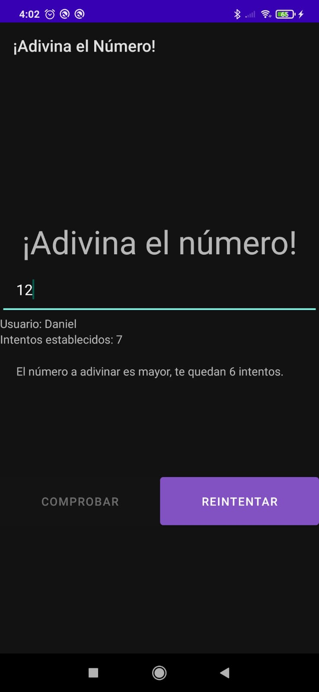
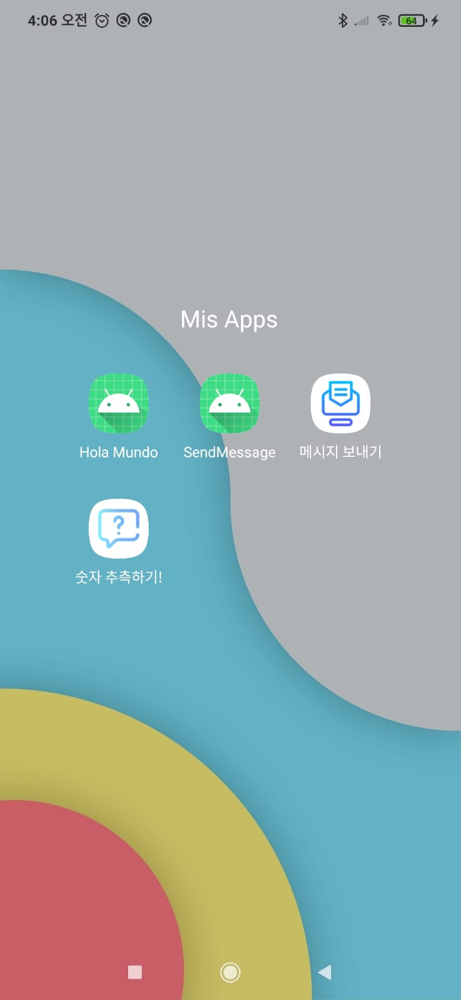

# Projecto 01 - Guess Number

## Información del proyecto

Este proyecto es un pequeño juego de adivinanza, en este tienes que descubrir el número aleatorio que se ha generado de forma automática en la cantidad de intentos que tu mismo dictes.

## Característica del proyecto

Guess number es el primer proyecto en DEINT (Desarrollo de interfaces).

Durante la realización de este proyecto hemos ultilizado a:
* Activitys que han sido conectadas entre ellas
    * Usando Bundle
    * Usando Intent
    * Usando ViewBinding y Data Binding
* Se ha usado el Toast para avisar de cuando era necesario la introducción de datos
* Se ha añadido icono de la app responsive
* Traducida la aplicación a inglés y coreano (Español por defecto)

## Novedades en el proyecto

Las novedades añadidas el projecto fuera de lo pedidos son:
* Traducido a un tercer idioma (Coreano)
* Icono personalizado
* Diseño más desarrollado

## Imágenes
> Programa instalado en nuestro dispositivo movil

> Config Activity (En español)

> Play Activity (En español)

> EndPlay Acitivity

> Versión Inglesa

> Versión Coreana

## Comentario personal sobre el proyecto

Ha estado bastante chulo desarrollarlo y ver como funciona, además de tener un pequeño juego funcional en el movil creado por ti mismo.

Lo hubiera disfrutado más si no hubiera ido con prisas a realizarlo, tengo que mejorar mi organización, sigo estando malo y me cuesta mucho hace cualquier cosa.

